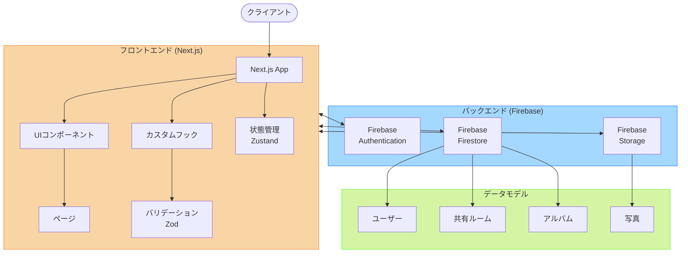

# アルバムアプリのアーキテクチャ

このドキュメントでは、アルバムアプリケーションのアーキテクチャ構成について説明します。

## システムアーキテクチャ

## 技術スタックの詳細

### フロントエンド

- **Next.js (App Router)**: ページルーティングとレンダリング
- **React**: UI コンポーネント構築
- **Tailwind CSS**: スタイリング
- **Zustand**: 状態管理
- **React Hook Form**: フォーム管理
- **Zod**: バリデーション

### バックエンド（Firebase）

- **Firebase Authentication**: ユーザー認証
- **Firestore**: NoSQL データベース
- **Firebase Storage**: 画像ストレージ

## データモデル

### ユーザー (Users)

| フィールド名 | 型                  | 説明                     |
| ------------ | ------------------- | ------------------------ |
| userId       | string              | ユーザーの一意識別子     |
| email        | string              | ユーザーのメールアドレス |
| displayName  | string              | ユーザーの表示名         |
| photoURL     | string (オプション) | プロフィール画像 URL     |
| createdAt    | timestamp           | アカウント作成日時       |

### 共有ルーム (ShareRooms)

| フィールド名    | 型        | 説明                 |
| --------------- | --------- | -------------------- |
| shareRoomId     | string    | ルームの一意識別子   |
| sharedRoomTitle | string    | ルームの表示タイトル |
| createdUserId   | string    | ルーム作成者の ID    |
| inviteCode      | string    | ルーム招待コード     |
| participantIds  | string[]  | 参加者 ID のリスト   |
| createdAt       | timestamp | ルーム作成日時       |
| updatedAt       | timestamp | 最終更新日時         |

### アルバム (Albums)

| フィールド名  | 型        | 説明                   |
| ------------- | --------- | ---------------------- |
| albumId       | string    | アルバムの一意識別子   |
| albumTitle    | string    | アルバムの表示タイトル |
| shareRoomId   | string    | 所属する共有ルーム ID  |
| createdUserId | string    | アルバム作成者の ID    |
| createdAt     | timestamp | アルバム作成日時       |
| updatedAt     | timestamp | 最終更新日時           |

### 写真 (Photos)

| フィールド名   | 型        | 説明                    |
| -------------- | --------- | ----------------------- |
| photoId        | string    | 写真の一意識別子        |
| albumId        | string    | 所属するアルバム ID     |
| photoUrl       | string    | 画像ファイルの URL      |
| uploadedUserId | string    | アップロードユーザー ID |
| fileName       | string    | オリジナルファイル名    |
| fileSize       | number    | ファイルサイズ(バイト)  |
| uploadedAt     | timestamp | アップロード日時        |

## セキュリティ

Firebase Security Rules によって、以下のセキュリティポリシーを実装しています：

1. ユーザーは自分自身のプロフィール情報のみ更新可能
2. 共有ルームのメンバーのみが、そのルーム内のアルバムと写真にアクセス可能
3. 写真のアップロード・削除は、共有ルームのメンバーのみ実行可能
4. 招待コードを知っているユーザーのみが共有ルームに参加可能
