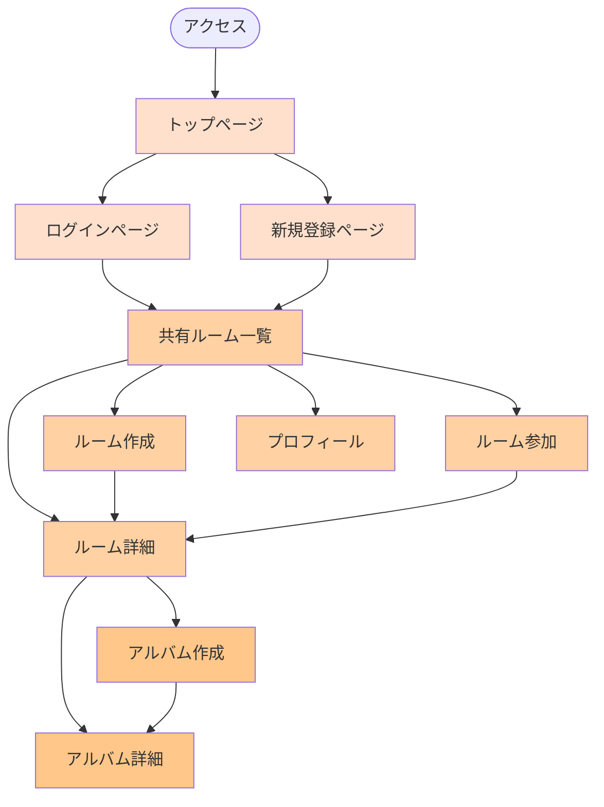

# アルバムアプリの画面遷移図

このドキュメントでは、アルバムアプリケーションの画面遷移フローを説明します。

## 画面遷移図

## 画面の説明

### 認証関連画面（薄いオレンジ）

- **トップページ**: アプリの入り口となるページ
- **ログインページ**: 既存ユーザーのログイン画面
- **新規登録ページ**: 新規ユーザー登録画面

### ルーム関連画面（中間のオレンジ）

- **共有ルーム一覧**: ユーザーが参加している共有ルームの一覧
- **ルーム作成**: 新しい共有ルームを作成する画面
- **ルーム参加**: 招待コードを使用して既存の共有ルームに参加する画面
- **ルーム詳細**: 特定の共有ルーム内のアルバム一覧を表示する画面
- **プロフィール**: ユーザープロフィールの表示・編集画面

### アルバム関連画面（濃いオレンジ）

- **アルバム作成**: 共有ルーム内に新しいアルバムを作成する画面
- **アルバム詳細**: アルバム内の写真一覧を表示する画面
